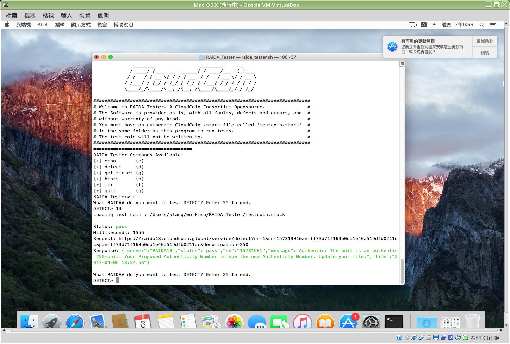
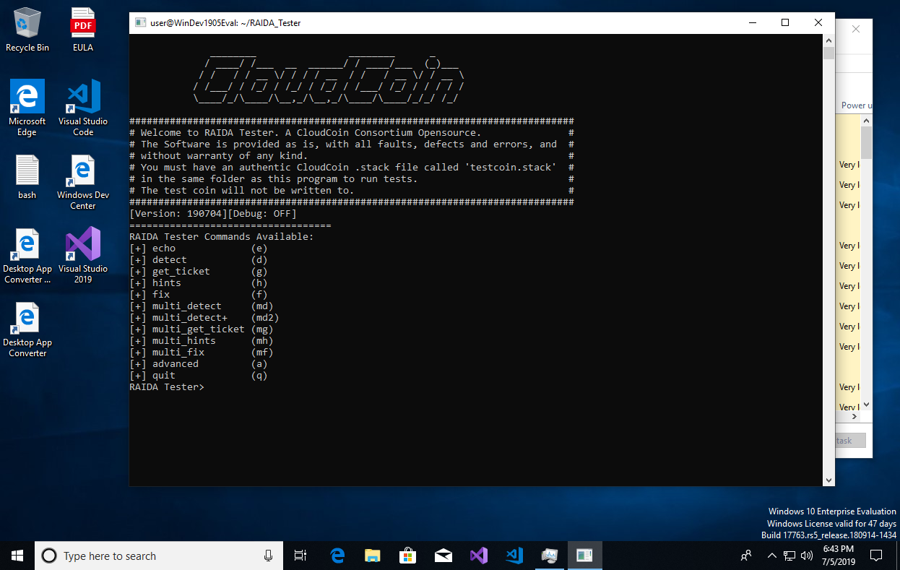

RAIDA Tester
============

The program is used to test [CloudCoin RAIDA](https://cloudcoinconsortium.org/) network, which is written in Bash.

It's able to work on all Linux distro, Mac OS and Windows 10 with WSL. 

Demonstration: https://asciinema.org/a/4bbzhe6azodv7ovl1nupg3k40




Dependencies
-------------
* Curl
* Jq
* dig
* Python
* bc

How to use it?
---------------
1. You must have several authentic CloudCoin .stack files called 'testcoin*.stack' in the same folder as this program to run tests.

2. Install the packages if they aren't installed yet.

```sh
sudo apt-get install jq curl dnsutils python bc
```
>In case any issues with jq installation on your computer please visit https://stedolan.github.io/jq/


3. Clone it to the computer then run it

```sh
git clone https://github.com/a-lang/RAIDA_Tester.git
cd RAIDA_Tester/
chmod +x *.sh
./raida_tester.sh
```

Hoping you like this.

## Reference

- [How to Install Linux Bash Shell on Windows 10](https://itsfoss.com/install-bash-on-windows/)

  

